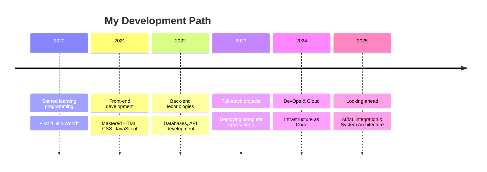

<div align="center">
  
  <br/>
  
</div>

## 🧠 About Me

```console
otmane@dev:~$ whoami
I transform ideas into code while constantly exploring new technologies. Currently building my programming portfolio and seeking open-source collaboration. Ask me about my coding journey - there's always a story to share!
```

<details>
  <summary>📈 Current Focus</summary>
  <br>
  🔭 Developing full-stack web applications<br>
  🌱 Expanding my cloud infrastructure knowledge<br>
  ⚡ Exploring AI/ML integration in applications
</details>

## 🧰 My Toolbox

<table>
  <tr>
    <td align="center" width="96">
      
      <br>React
    </td>
    <td align="center" width="96">
      
      <br>JavaScript
    </td>
    <td align="center" width="96">
      
      <br>TypeScript
    </td>
    <td align="center" width="96">
      
      <br>AWS
    </td>
    <td align="center" width="96">
      
      <br>Python
    </td>
    <td align="center" width="96">
      
      <br>Django
    </td>
    <td align="center" width="96">
      
      <br>Java
    </td>
  </tr>
  <tr>
    <td align="center" width="96">
      
      <br>Docker
    </td>
    <td align="center" width="96">
      
      <br>Nginx
    </td>
    <td align="center" width="96">
      
      <br>MySQL
    </td>
    <td align="center" width="96">
      
      <br>GitHub
    </td>
    <td align="center" width="96">
      
      <br>C++
    </td>
    <td align="center" width="96">
      
      <br>Sass
    </td>
    <td align="center" width="96">
      
      <br>REST API
    </td>
  </tr>
  <tr>
    <td align="center" width="96">
      
      <br>MongoDB
    </td>
    <td align="center" width="96">
      
      <br>Next.js
    </td>
    <td align="center" width="96">
      
      <br>TensorFlow
    </td>
    <td align="center" width="96">
      
      <br>Figma
    </td>
    <td align="center" width="96">
      
      <br>PHP
    </td>
    <td align="center" width="96">
      
      <br>Laravel
    </td>
    <td align="center" width="96">
      
      <br>PostgreSQL
    </td>
  </tr>
</table>

<details>
  <summary>🔍 Additional Skills</summary>
  <br>
  <p align="center">
    <a href="#"></a>
    <a href="#"></a>
    <a href="#"></a>
    <a href="#"></a>
    <a href="#"></a>
    <a href="#"></a>
    <a href="#"></a>
    <a href="#"></a>
    <a href="#"></a>
    <a href="#"></a>
    <a href="#"></a>
    <a href="#"></a>
  </p>
</details>

## 📊 GitHub Analytics

<p align="center">
  
</p>
<p align="center">
  
</p>
<p align="center">

</p>

## 🔝 Top Contributed Repo

<p align="center">

</p>

## 🏆 GitHub Trophies

<p align="center">
  
</p>

## 💻 Coding Journey



## 📫 Connect With Me
<br/>
<div align="center">
  <a href="https://www.linkedin.com/in/otmane-touhami/" target="_blank">
    
  </a>
  <a href="https://x.com/OtmaneTouhami" target="_blank">
    
  </a>
  <a href="mailto:otmanetouhami.dev@gmail.com" target="_blank">
    
  </a>
</div>

## ✍️ Random Dev Quote

<div align="center">
  

